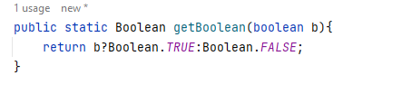
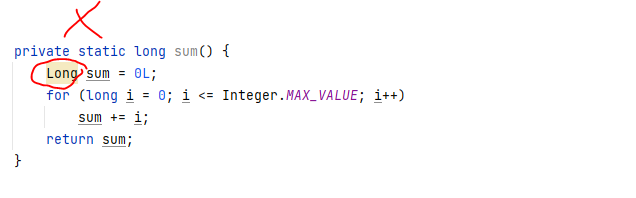
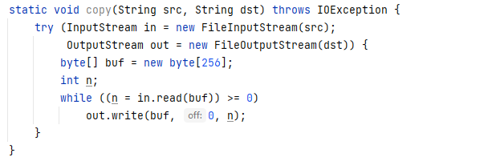

# Creating and Destroying Objects

## [ITEM-1] Consider static factory methods instead of constructor
### Advantages

1- They are not required to create a new object each time they are invoked.

The ability of static factory methods to return the same object from repeated
invocations allows classes to maintain strict control over what instances exist at
any time.\
Classes that do this are said to be _instance-controlled_.\ 
Instance control allows a class to guarantee that it is a **_singleton_** or non instantiable.\
Also, it allows an immutable value class.

2- Static factory methods is that, unlike constructors, they can return an object of any subtype of their return type.

interface-based frameworks

## [ITEM-6] Avoid creating unnecessary objects.

Constructor creates an instance so it's not effective. Immutable should be preferred.

    String s = new String("apple");             DONT USE IT  
    String s = "apple";                         USE IT

Not effective matches matched create instance internally,
so it is not suitable for repeated use in performance-critical issue.

    static boolean isRomanNumeral(String s) {
        return s.matches("^(?=.)M*(C[MD]|D?C{0,3})" + "(X[CL]|L?X{0,3})(I[XV]|V?I{0,3})$");
    }

    public class RomanNumerals {
        private static final Pattern ROMAN = Pattern.compile("^(?=.)M*(C[MD]|D?C{0,3})" + "(X[CL]|L?X{0,3})(I[XV]|V?I{0,3})$");
        static boolean isRomanNumeral(String s) {
            return ROMAN.matcher(s).matches();
        }
    }

Another way is autoboxing, which allows the programmer to mix primitive and boxed primitive types, boxing and unboxing
 Autoboxing blurs but does not erase the distinction between primitive and boxed primitive types.

## [ITEM-9] Prefer try-with-resources to try-finally

With java7 try-with-resource statement is more effective than other statements. However, resource must be implemented the AutoCloseable.

