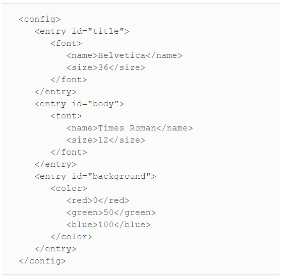

# CORE JAVA VOLUME-2

## Chapter-3 XML

The XML format allows you to express the hierarchy
and record repeated elements without contortions.

It looks similar to an HTML file. There is a good reason for that
—both XML and HTML are descendants of the venerable
_**Standard Generalized Markup Language**_ (SGML).
SGML has been around since the 1970s for describing
the structure of complex documents. However, SGML is quite complex,
so it has never caught on in a big way. XML was designed as a
simplified version of SGML for use on the Internet.

### Parsing an XML Document.

Java Library supplies two kinds of XML parsers.
1- DOM(Document Object Model)