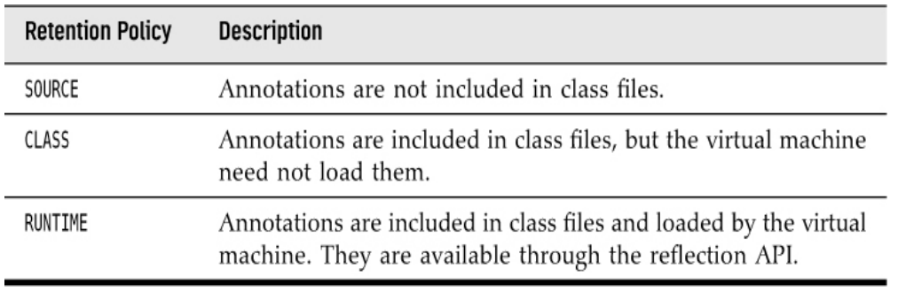

# Chapter 8 - Scripting, Compiling, and Annotation Processing

##  SCRIPTING FOR THE JAVA PLATFORM
A scripting language is a language that avoids the
usual edit/compile/link/run cycle by interpreting the
program text at runtime.

Scripting languages have a number of advantages:
* Rapid turnaround, encouraging experimentation.
* Changing the behavior of a running program.
* Enabling customization by program users.

On the other hand, most scripting languages lack features that are beneficial for programming complex
applications, such as strong typing, encapsulation, and modularity.

It is therefore tempting to combine the advantages of
scripting and traditional languages.

### Getting a Scripting Engine

    ScriptEngineManager manager = new ScriptEngineManager();
    ScriptEngine engine = manager.getEngineByName("rhino");

> You need to provide the JAR files that implement the script engine on the
classpath. (The Oracle JDK used to contain a JavaScript engine, but it has
been removed in Java 15.)
> 
### Script Evaluation and Bindings

Once you have engine, you can call a script string or reader.

    Object result = engine.eval(scriptStrings);
    Object result2  = engine eval(reader)

You will want to add variable bindings to the engine.
    
    engine.put("k",76);
    engine.eval("k+1");
    Object result = engine.get("k");

Result: 77

Second way binding object.

    Bindings scope = engine.createBindings();
    scope.put("b",new JButton);
    engine.eval(scriptString,scope);

### Calling Scripting Functions and Methods

With many script engines, you can invoke a function in the scripting
language without having to evaluate the actual script code.

The script engines that offer this functionality implement the Invocable
interface. In particular, the Rhino engine implements Invocable.

To call a function, call the invokeFunction method with the function
name.
    
    engine.eval("function greet(how,whom){
        return how + ',' + whom + '!'; 
    }")

    Object result = ((Invocable) engine).invokeFunction("greet","Hello","There");

> If the scripting language is object-oriented, call **invokeMethod**.

###  Compiling a Script

Some scripting engines can compile scripting code.
Those engines implement the Compilable interface.

    FileReader reader = new FileReader("myscript.js");
    CompiledScript script = null;
    if(engine implements Compilable){
        script = ((Compilable) engine).compile(reader);
    }

Once the script is compiled, you can execute it.
    
    if(script != null){
        script.eval();
    }else
    engine.eval(reader);

## The Compiler API
There are quite a few tools that need to compile Java code. Obviously,
development environments and programs that teach Java programming are
among them, as well as testing and build automation tools.

### Invoking the Compiler

    JavaCompiler compiler = ToolProvider.getSystemJavaCompiler();
    OutputStream outStream = . . .;
    OutputStream errStream = . . .;

    int result = compiler.run(null,outStream,errStream," -sourcepath","src","Test.java");

###  Launching a Compilation Task
You can have more control over a compilation process with CompilationTask object.

    JavaCompiler.ComplilationTask task = compiler.getTask(errorWriter, fileManager, diagnostics, options, classes, sources);
### Capturing Diagnostics

To listen to error messages, install a **DiagnosticListener**. The listener
receives a Diagnostic object whenever the compiler reports a warning or
error message. The **DiagnosticCollector** class implements this
interface. It simply collects all diagnostics so that you can iterate through
them after the compilation is complete.

    DiagnosticCollector<JavaFileObject> collector = new DiagnosticCollector<>();
    compiler.getTask(null,fileManager, collector, null, null, sources).call();
    for(Diagnostic<? extends JavaFileObjects> d: collector.getDiagnostics){
        System.out.println(d);
    }

> A **Diagnostic** object contains information about the problem location
(including file name, line number, and column number) as well as a human-readable description.

### Reading Source Files from Memory
If you generate source code on the fly, you can have it compiled from
memory, without having to save files to disk.

    public class StringSource extends SimpleJavaFileObject{
        private String code;
        StringSource(String name, String code){
            super(URI.create("string:///" + name.replace('.','/') +
            ".java"), Kind.SOURCE);
            this.code = code;
        }
        public CharSequence getCharContent(boolean ignoreEncodingErrors){
            return code;
        }
    }

Then generate the code for your classes and give the compiler a list of StringSource objects:

    List<StringSource> sources = List.of(new StringSource(className1, class1CodeString), . . .);
    task = compiler.getTask(null, fileManager, diagnostics, null,null, sources);

## Using Annotations
Annotations are tags that you insert into your source code so that some tool
can process them.

Annotations do not change the way in which your programs are compiled.

The Java compiler generates the same virtual machine instructions with or
without the annotations.

To benefit from annotations, you need to select a processing tool. Use
annotations that your processing tool understands, then apply the processing
tool to your code.

## Annotation Syntax

### Annotation Interfaces
    modifiers @interface AnnotationName{
        elementDecleration1
        elementDecleration2
    }

> All annotation interfaces implicitly extend the
java.lang.annotation.Annotation inter-face.

The type of annotation element is one of the following:
* A primitive type (int, short, long, byte, char, double, float, or boolean)
* String
* Class (with an optional type parameter such as Class<? extends MyClass>)
* An enum type
* An annotation type
* An array of the preceding types (an array of arrays is not a legal element type)

    public @interface BugReport{
        enum Status { UNCONFIRMED, CONFIRMED, FIXED, NOTABUG };
        boolean showStopper() default false;
        String assignedTo() default "[none]";
        Class<?> testCase() default Void.class;
        Status status() default Status.UNCONFIRMED;
        Reference ref() default @Reference(); // an annotation type
        String[] reportedBy();
    }

## Annotations

The Format should be on the below.
    
    @AnnotationName(elementName1=value1, elementName2=value2, . . .)

    @BugReport(assignedTo="Harry",severity=10)
    @BugReport(severity=10) by default value assignedTo=none

> Defaults are not stored with the annotation; instead, they are dynamically
computed. For example, if you change the default for the assignedTo
element to "[]" and recompile the BugReport interface, the
annotation @BugReport(severity=10) will use the new default,
even in class files that have not been recompiled after the default
changed.

**Single-value Annotations**

    public @interface ActionListenerFor{
        String value();
    }

Using it with value or not the same.

    @ActionListenerFor("Yellow Button") === @ActionListenerFor(value="Yellow Button")

> An annotation element can never be set to null. We need to find other defaults such as "" or Void.class.

## Standard Annotations
### Meta-Annotations

The **@Target** meta-annotation is applied to an annotation, restricting the
items to which the annotation applies.

The **@Retention** meta-annotation specifies how long an annotation is
retained.

Suppose you define an inherited annotation **@Persistent** to indicate that
objects of a class can be saved in a database. Then the subclasses of
persistent classes are automatically annotated as persistent.

    @Inherited @interface Persistent { }
    @Persistent class Employee { . . . }
    class Manager extends Employee { . . . } // also @Persistent

As of Java 8, it is legal to apply the same annotation type multiple times to
an item. For backward compatibility, the implementor of a repeatable
annotation needs to provide a container annotation that holds the repeated
annotations in an array.

    @Repeatable(TestCases.class)
    @interface TestCase{
        String params();
        String expected();
    }
    
    
    @interface TestCases{
        TestCase[] value();
    }

> Whenever the user supplies two or more @TestCase annotations, they are
automatically wrapped into a @TestCases annotation.

## Source-Level Annotation Processing
Another use for annotation is the automatic processing of source
files to _produce more source code, configuration files, scripts_, or _whatever
else_ one might want to generate.

### Annotation Processors
Annotation processing is integrated into the Java compiler. During
compilation, you can invoke annotation processors by running

    javac -processor ProcessorClassName1,ProcessorClassName2,. . .sourceFiles

> An annotation processor can only generate new source files. It cannot
modify an existing source file.

An annotation processor implements the Processor interface, generally
by extending the AbstractProcessor class. You need to specify which
annotations your processor supports.

    @SupportedAnnotationTypes("com.horstmann.annotations.ToString")
    @SupportedSourceVersion(SourceVersion.RELEASE_8)
    public class ToStringAnnotationProcessor extends AbstractProcessor{
        public boolean process(Set<? extends TypeElement> annotations, RoundEnvironment currentRound){
            . . .
        }
    }

### Using Annotations to Generate Source Code

We can’t put these methods into the
original classes—annotation processors can only produce new classes, not
modify existing ones.

    public class ToStrings{
        public static String toString(Point obj){
            Generated code
        }
        public static String toString(Rectangle obj){
            Generated code
        }
        . . .
        public static String toString(Object obj){
            return Objects.toString(obj);
        }
    }

We don’t want to use reflection, so we annotate accessor methods, not fields.

    @ToString
    public class Rectangle{
        . . .
        @ToString(includeName=false) 
        public Point getTopLeft() {
            return topLeft; 
        }
        @ToString 
        public int getWidth() {
            return width;
        }
        @ToString 
        public int getHeight() {
            return height;
        }
    }

The annotation processor should then generate the following source code.

    public static String toString(Rectangle obj) {
        var result = new StringBuilder();
        result.append("Rectangle");
        result.append("[");
        result.append(toString(obj.getTopLeft()));
        result.append(",");
        result.append("width=");
        result.append(toString(obj.getWidth()));
        result.append(",");
        result.append("height=");
        result.append(toString(obj.getHeight()));
        result.append("]");
        return result.toString();
    }

Here is an outline of the method that produces the toString method for a class with a given TypeElement.

    private void writeToStringMethod(PrintWriter out, TypeElement te){
        String className = te.getQualifiedName().toString();
        // Print method header and declaration of string builder
        ToString ann = te.getAnnotation(ToString.class);
        if (ann.includeName())
        // Print code to add class name
        for (Element c : te.getEnclosedElements()){
            ann = c.getAnnotation(ToString.class);
        if (ann != null){
        if (ann.includeName()) 
        // Print code to add field name
    Print code to append toString(obj.methodName())
    }
    }
    Print code to return string
    }

    

    

