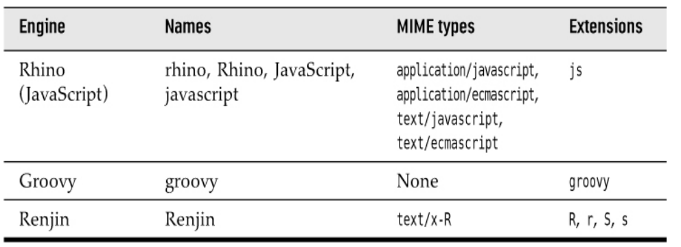

# Chapter 8 - Scripting, Compiling, and Annotation Processing

##  SCRIPTING FOR THE JAVA PLATFORM
A scripting language is a language that avoids the
usual edit/compile/link/run cycle by interpreting the
program text at runtime.

Scripting languages have a number of advantages:
* Rapid turnaround, encouraging experimentation.
* Changing the behavior of a running program.
* Enabling customization by program users.

On the other hand, most scripting languages lack features that are beneficial for programming complex
applications, such as strong typing, encapsulation, and modularity.

It is therefore tempting to combine the advantages of
scripting and traditional languages.

### Getting a Scripting Engine

    ScriptEngineManager manager = new ScriptEngineManager();
    ScriptEngine engine = manager.getEngineByName("rhino");

> You need to provide the JAR files that implement the script engine on the
classpath. (The Oracle JDK used to contain a JavaScript engine, but it has
been removed in Java 15.)
> 
### Script Evaluation and Bindings

Once you have engine, you can call a script string or reader.

    Object result = engine.eval(scriptStrings);
    Object result2  = engine eval(reader)

You will want to add variable bindings to the engine.
    
    engine.put("k",76);
    engine.eval("k+1");
    Object result = engine.get("k");

Result: 77

Second way binding object.

    Bindings scope = engine.createBindings();
    scope.put("b",new JButton);
    engine.eval(scriptString,scope);

### Calling Scripting Functions and Methods

With many script engines, you can invoke a function in the scripting
language without having to evaluate the actual script code.

The script engines that offer this functionality implement the Invocable
interface. In particular, the Rhino engine implements Invocable.

To call a function, call the invokeFunction method with the function
name.
    
    engine.eval("function greet(how,whom){
        return how + ',' + whom + '!'; 
    }")

    Object result = ((Invocable) engine).invokeFunction("greet","Hello","There");

> If the scripting language is object-oriented, call **invokeMethod**.

###  Compiling a Script

Some scripting engines can compile scripting code.
Those engines implement the Compilable interface.

    FileReader reader = new FileReader("myscript.js");
    CompiledScript script = null;
    if(engine implements Compilable){
        script = ((Compilable) engine).compile(reader);
    }

Once the script is compiled, you can execute it.
    
    if(script != null){
        script.eval();
    }else
    engine.eval(reader);

## The Compiler API
There are quite a few tools that need to compile Java code. Obviously,
development environments and programs that teach Java programming are
among them, as well as testing and build automation tools.

### Invoking the Compiler

    JavaCompiler compiler = ToolProvider.getSystemJavaCompiler();
    OutputStream outStream = . . .;
    OutputStream errStream = . . .;

    int result = compiler.run(null,outStream,errStream," -sourcepath","src","Test.java");

###  Launching a Compilation Task
You can have more control over a compilation process with CompilationTask object.

    JavaCompiler.ComplilationTask task = compiler.getTask(errorWriter, fileManager, diagnostics, options, classes, sources);
### Capturing Diagnostics

To listen to error messages, install a **DiagnosticListener**. The listener
receives a Diagnostic object whenever the compiler reports a warning or
error message. The **DiagnosticCollector** class implements this
interface. It simply collects all diagnostics so that you can iterate through
them after the compilation is complete.

    DiagnosticCollector<JavaFileObject> collector = new DiagnosticCollector<>();
    compiler.getTask(null,fileManager, collector, null, null, sources).call();
    for(Diagnostic<? extends JavaFileObjects> d: collector.getDiagnostics){
        System.out.println(d);
    }

> A **Diagnostic** object contains information about the problem location
(including file name, line number, and column number) as well as a human-readable description.

Page 663

    

    

    

